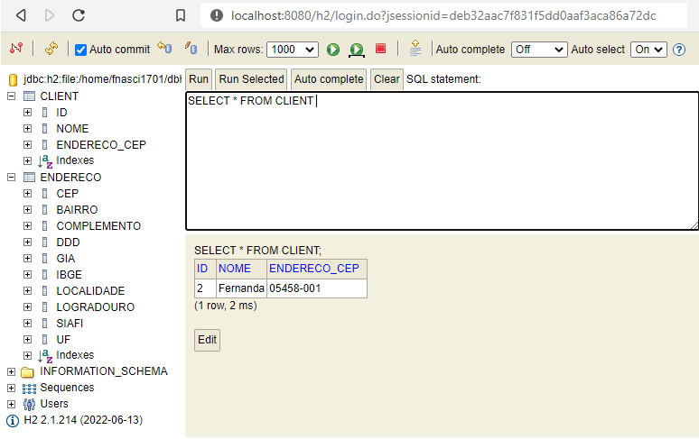

<p align="center">
    <a href="https://github.com/Fernanda1701/cadastro-de-pessoas/blob/main/README.md">☆ Português Brasileiro</a>
    <a href="https://github.com/Fernanda1701/cadastro-de-pessoas/blob/main/README.eng.md">☆ English ☆</a> 
</p>


<h1 align="center">
    <a href="https://github.com/Fernanda1701/cadastro-de-pessoas">Cadastro de Pessoas 📑</a>
</h1>
<p align="center">People registration App exploring Project Patterns with Spring and Postal Code API</p>

<h2 align="center">

</h2>


## 💎 About

The project was developed to fix the concepts of Design Patterns in <b><i>Spring</b></i>, these being:

- <b>Singleton</b> (with @Bean and @Autowired)
- <b>Strategy</b> (with @Service and @Repository)
- <b>Facade</b> (creating a REST API abstracting the complexity of Spring Data JPA and ViaCep API integrations through OpenFeign)


<h3>Operation</h3>

The <b>Cadastro de pessoas</b> App is made in <b><i>Spring</b></i>, and its purpose is to <i>register, update, search</i> (by all or id) <i>and delete</i> 
a <b>Client</b>. The registration can be done with just the <b>name and ZIP code</b> of the customer, in <b><i>Json</b></i> pattern, as shown below:


```bash
 {
    "nome": "Fernanda",
    "endereco": {
      "cep": "05458001"
     }
   } 
```


An <b>ID</b> will be <i>automatically generated</i> and the API will take care of completing the remaining address fields:


```bash
[
  {
    "id": 2,
    "nome": "Fernanda",
    "endereco": {
      "cep": "05458-001",
      "logradouro": "Avenida Diógenes Ribeiro de Lima",
      "complemento": "de 671/672 a 2619/2620",
      "bairro": "Alto de Pinheiros",
      "localidade": "São Paulo",
      "uf": "SP",
      "ibge": "3550308",
      "gia": "1004",
      "ddd": "11",
      "siafi": "7107"
    }
  }
]
```

With a successful <b>POST</b>, we will have it registered in the <b>H2 Database</b>, which will create two tables, one <b><i>Client</b></i> and the other <b><i>Address</b></i> shown below:


<h3 align="center">Banco de Dados H2</h3>

<p align="center">
  
</p>


## ⚙️ Execution

After downloading the project, open it in the IDE of your choice and run it. When you run it, it will open at the following address:

```bash
http://localhost:8080/clientes
```

There you will be able to make HTTP requests. To access the database, open it at the following address:

```bash
http://localhost:8080/h2
```

In the <b>JDBC URL</b> enter:

```bash
jdbc:h2:file:/home/fnasci1701/dbh2teset
```

```bash
Username : sa
Password: 
```

Now, with everything working, just have fun!!


## 🛠 Technologies

- Application initialized with [Spring Initializr](https://start.spring.io/)
- [Java](https://www.java.com/) 11
- [Maven](https://maven.apache.org/) 4.0.0
- [Spring Boot](https://spring.io/projects/spring-boot) 2.7.2
- [H2 Database](https://www.h2database.com/html/main.html)
- Code versioning on [Git](https://git-scm.com/)

### Dependencies:

- [Spring Data JPA](https://spring.io/projects/spring-data-jpa)
- [Spring Web](https://docs.spring.io/spring-framework/docs/current/reference/html/web.html#spring-web)
- [H2](https://www.baeldung.com/spring-boot-h2-database)
- [OpenFeign](https://spring.io/projects/spring-cloud-openfeign)
 

## 💻 IDE

IDE used: [IntelliJ](https://www.jetbrains.com/pt-br/idea/)

## Author:

<a href="https://github.com/Fernanda1701">
 
 <br />
 <sub><b>Fernanda Nascimento</b></sub></a> <a href="https://github.com/Fernanda1701"></a>

Contact Me ✉️:

[](https://www.linkedin.com/in/fnasci/)
[](mailto:fnasci.1701@gmail.com)
