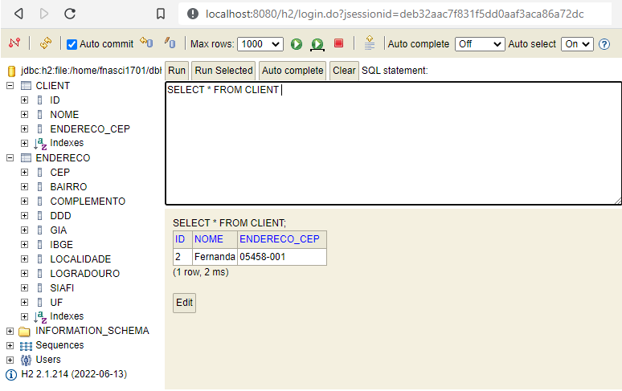

<p align="center">
    <a href="https://github.com/Fernanda1701/cadastro-de-pessoas/blob/main/README.md">☆ Português Brasileiro</a>
    <a href="https://github.com/Fernanda1701/cadastro-de-pessoas/blob/main/README.eng.md">☆ English ☆</a> 
</p>


<h1 align="center">
    <a href="https://github.com/Fernanda1701/cadastro-de-pessoas">Cadastro de Pessoas 📑</a>
</h1>
<p align="center">App de cadastro de pessoas explorando Padrões de Projetos com Spring e API de Cep</p>

<h2 align="center">

</h2>


## 💎 Sobre

O projeto foi desenvolvido para a fixação de conceitos de Padrões de Projeto em <b><i>Spring</b></i>, sendo eles:

- <b>Singleton</b> (com @Bean e @Autowired)
- <b>Strategy</b> (com @Service e @Repository)
- <b>Facade</b> (criando uma API REST abstraindo a complexidade das integrações de Spring Data JPA e ViaCep API através do OpenFeign)

<h3>Funcionamento</h3>

O App <b>Cadastro de Pessoas</b> é feito em <b><i>Spring</b></i>, e tem como finalidade <i>cadastrar, atualizar, buscar</i> (por todos ou por id) <i>e deletar</i> um <b>Cliente</b>. 
O cadastro pode ser feito com apenas o <b>nome e o Cep do Cliente</b>, no padrão <b><i>Json</b></i>, como demonstrado abaixo:

```bash
 {
    "nome": "Fernanda",
    "endereco": {
      "cep": "05458001"
     }
   } 
```

Será <i>gerado automaticamente</i> um <b>ID</b> e a API se encarregará de completar os campos de endereço restantes, sendo eles:

```bash
[
  {
    "id": 2,
    "nome": "Fernanda",
    "endereco": {
      "cep": "05458-001",
      "logradouro": "Avenida Diógenes Ribeiro de Lima",
      "complemento": "de 671/672 a 2619/2620",
      "bairro": "Alto de Pinheiros",
      "localidade": "São Paulo",
      "uf": "SP",
      "ibge": "3550308",
      "gia": "1004",
      "ddd": "11",
      "siafi": "7107"
    }
  }
]
```
Com o <b>POST</b> bem sucedido, teremos o cadastro do mesmo no <b>Banco de Dados H2</b>, que criará duas tabelas, uma <b><i>Client</b></i> e a outra <b><i>Endereço</b></i> demonstradas abaixo:

<h3 align="center">Banco de Dados H2</h3>

<p align="center">
  
</p>


## ⚙️ Execução

Após baixar o projeto, abra-o na IDE de sua preferência e rode-o. Quando rodar ele abrirá no seguninte endereco:

```bash
http://localhost:8080/clientes
```

Nele será peritido efetuar requisições HTTP. Para ter acesso ao Banco de Dados, abra no seguinte endereço

```bash
http://localhost:8080/h2
```

No <b>JDBC URL</b> coloque:

```bash
jdbc:h2:file:/home/fnasci1701/dbh2teset
```

```bash
Username : sa
Password: 
```

Agora, com tudo funcionando, é só se divertir!!


## 🛠 Tecnologias

- Aplicação inicializada com [Spring Initializr](https://start.spring.io/)
- [Java](https://www.java.com/) 11
- [Maven](https://maven.apache.org/) 4.0.0
- [Spring Boot](https://spring.io/projects/spring-boot) 2.7.2
- [H2 Database](https://www.h2database.com/html/main.html)
- Versionamento de código no [Git](https://git-scm.com/)

### Dependências:

- [Spring Data JPA](https://spring.io/projects/spring-data-jpa)
- [Spring Web](https://docs.spring.io/spring-framework/docs/current/reference/html/web.html#spring-web)
- [H2](https://www.baeldung.com/spring-boot-h2-database)
- [OpenFeign](https://spring.io/projects/spring-cloud-openfeign)

## 💻 IDE

IDE utilizada: [IntelliJ](https://www.jetbrains.com/pt-br/idea/)

## Autor:

<a href="https://github.com/Fernanda1701">
 
 <br />
 <sub><b>Fernanda Nascimento</b></sub></a> <a href="https://github.com/Fernanda1701"></a>

Entre em contato ✉️:

[](https://www.linkedin.com/in/fnasci/)
[](mailto:fnasci.1701@gmail.com)
